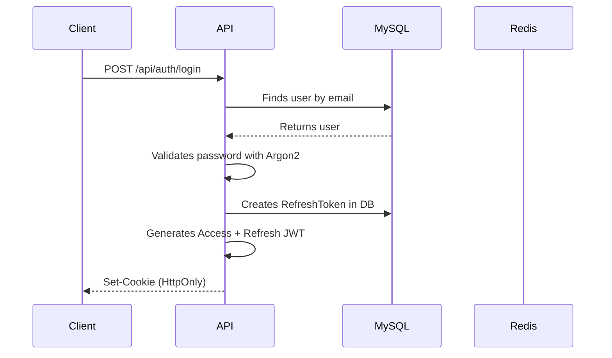
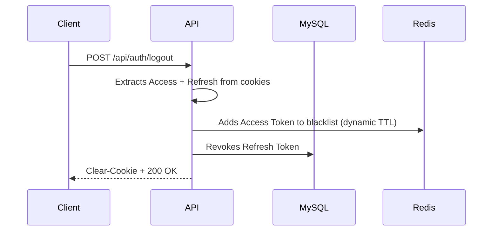

# 🔐 Secure Distributed Auth Gateway

[](README.md)
[](README.pt-br.md)


Professional JWT authentication system based on **HttpOnly Cookies**, **Redis Blacklist**, and **CSRF Protection**, following OWASP standards and Clean Architecture.

---

## 🎯 Goal

This is a **Proof of Concept (PoC)** demonstrating:

- ✅ **Hybrid** authentication strategy (Stateless JWT + Stateful Redis Revocation)
- ✅ **Automatic Token Rotation** with **Grace Period** (UX vs Security trade-off)
- ✅ **Reuse Detection** (Security-first approach: detects theft vs false positives)
- ✅ **Hybrid Rate Limiting** (by IP + Email for login, preventing brute-force)
- ✅ **CSRF Protection** (Defense in depth: Synchronizer Token + SameSite=Strict)
- ✅ **HttpOnly Cookies** (XSS mitigation)
- ✅ **Clean Architecture** (Controllers → Services → Repositories)

---

## ⚖️ Security Trade-offs & Design Decisions

### 1. Hybrid Architecture (Stateless vs Stateful)
While JWT is natively stateless, this architecture implements a **Hybrid Strategy**. We use Redis for immediate revocation (Stateful) and JWT for identity propagation. **Why?** Pure statelessness prevents immediate logout/ban. This hybrid approach offers the best of both worlds: performance of JWT with the control of sessions.

### 2. Grace Period Window
To prevent UX failures due to race conditions (concurrent requests rotating tokens), we implement a **5-10s Grace Period**.
- **Risk:** An attacker could theoretically use a stolen token within this small window.
- **Decision:** We prioritize UX stability. The window is minimal and monitored.

### 3. Reuse Detection (False Positive Risk)
If a token is reused, we revoke **ALL** user sessions.
- **Scenario:** If a legitimate user has a slow connection and retry logic triggers a reuse, they might be logged out.
- **Decision:** We treat *any* reuse as a potential theft. It's better to force a legitimate user to re-login than to allow an attacker to persist.

### 4. CSRF: Double Protection
Modern browsers support `SameSite=Strict`, which technically prevents CSRF. However, we maintain the **Synchronizer Token Pattern** as a **Defense in Depth** layer, ensuring security even against older browsers or subtle SameSite bypasses.

---

## 🛠️ Tech Stack

| Category | Technology |
|-----------|------------|
| **Runtime** | Node.js 20 + TypeScript (Strict Mode) |
| **Framework** | Express.js |
| **Database** | MySQL 8.0 (via Prisma ORM) |
| **Cache & Blacklist** | Redis 7 |
| **Hashing** | Argon2id (Password Hashing Competition winner) |
| **Tokens** | JSON Web Tokens (JWT) |
| **Validation** | Zod |
| **Security** | Helmet, CORS, HPP, Rate Limiter Flexible |
| **DevOps** | Docker + Docker Compose, GitHub Actions |

---

## 📂 Folder Architecture

```
secure-auth-poc/
├── src/
│   ├── @types/             # Global Type definitions
│   ├── config/             # Env validation (Zod)
│   ├── modules/            # Business Modules
│   │   ├── auth/           # Authentication (Login, Refresh, Logout)
│   │   └── user/           # User (Profile, Update Password)
│   ├── shared/             # Reusable Code
│   │   ├── errors/         # Custom AppError
│   │   ├── middlewares/    # AuthGuard, RateLimiter, CSRF
│   │   ├── utils/          # HashProvider, TokenManager, Blacklist
│   │   └── infra/          # Redis Client
│   ├── app.ts              # Express Setup
│   └── server.ts           # Entry point
├── prisma/
│   └── schema.prisma       # Database Model
├── docker-compose.yml      # MySQL + Redis
└── README.md
```

---

## 🚀 How to Run

### 1. Clone the repository

```bash
git clone https://github.com/GersonResplandes/secure-auth-poc.git
cd secure-auth-poc
```

### 2. Configure environment variables

```bash
cp .env.example .env
# Edit .env and change JWT and CSRF secrets
```

### 3. Start environment with Docker

```bash
npm run docker:up
```

This will start:
- **MySQL** (port 3306)
- **Redis** (port 6379)

### 4. Install dependencies

```bash
npm install
```

### 5. Run Prisma migrations

```bash
npx prisma migrate dev
```

### 6. Start the server

```bash
npm run dev
```

The server will be running at **http://localhost:3000**

---

## 🧪 Running Tests

This project has **unit** and **integration** tests with automatic infrastructure management.

### Run All Tests (Recommended)

```bash
npm test
```

**What happens:**
1. ✅ Docker containers (MySQL + Redis) start automatically
2. ✅ Unit tests run (HashProvider, TokenManager)
3. ✅ Integration tests run (Full Auth flow)
4. ✅ Containers stay running for reuse

**Expected result:** `46 tests passed`

### Unit Tests Only (Fast - No Docker)

```bash
npm run test:unit
```

Runs only tests that do not depend on infrastructure (~2s).

### Integration Tests Only

```bash
npm run test:integration
```

Tests end-to-end flows (Register → Login → Refresh → Logout).

### Coverage Report

```bash
npm run test:coverage
```

Generates coverage report in `coverage/lcov-report/index.html`.

**Threshold:** 70% (branches, functions, lines, statements)

### Stop Test Infrastructure

```bash
npm run docker:down
```

---

## 📖 API Endpoints

### **Authentication**

#### POST `/api/auth/register`

Registers a new user.

**Body:**
```json
{
  "email": "user@example.com",
  "password": "Password123",
  "name": "John Doe"
}
```

**Response (201):**
```json
{
  "status": "success",
  "message": "User registered successfully",
  "data": {
    "user": {
      "id": "uuid",
      "email": "user@example.com",
      "name": "John Doe",
      "createdAt": "2024-01-01T00:00:00.000Z"
    }
  }
}
```

---

#### POST `/api/auth/login`

Logs in and returns HttpOnly cookies.

**Body:**
```json
{
  "email": "user@example.com",
  "password": "Password123",
  "rememberMe": false
}
```

**Response (200):**
```json
{
  "status": "success",
  "message": "Login successful",
  "data": {
    "user": {
      "id": "uuid",
      "email": "user@example.com",
      "name": "John Doe"
    }
  }
}
```

**Cookies sent:**
- `access_token` (15 min, HttpOnly, Secure, SameSite=Strict)
- `refresh_token` (7 days or 30 days if `rememberMe=true`)

---

#### POST `/api/auth/refresh`

Renews Access Token using Automatic Rotation.

**Response (200):**
```json
{
  "status": "success",
  "message": "Tokens refreshed successfully"
}
```

---

#### POST `/api/auth/logout`

Revokes tokens and clears cookies.

**Response (200):**
```json
{
  "status": "success",
  "message": "Logout successful"
}
```

---

### **User (Protected)**

#### GET `/api/users/me`

Returns authenticated user data.

**Response (200):**
```json
{
  "status": "success",
  "data": {
    "user": {
      "userId": "uuid",
      "email": "user@example.com"
    }
  }
}
```

---

#### PATCH `/api/users/password`

Updates user password.

**Body:**
```json
{
  "currentPassword": "Password123",
  "newPassword": "NewPassword456"
}
```

**Response (200):**
```json
{
  "status": "success",
  "message": "Password updated successfully. Please login again."
}
```

> **Note:** All active tokens are revoked after password update.

---

## 🔒 Architecture Decisions (ADRs)

### 1. Why HttpOnly Cookies?

**Problem:** Tokens stored in `localStorage` are vulnerable to XSS attacks.

**Solution:** Cookies with the `HttpOnly` flag are not accessible via JavaScript, protecting against malicious scripts.

---

### 2. Why Redis Blacklist?

**Problem:** JWT is stateless, so there is no way to revoke a token before expiration.

**Solution:** On logout or password change, the token is added to a Redis blacklist with **dynamic TTL** (calculated from token expiration).

---

### 3. Why Automatic Rotation + Grace Period?

**Problem:** In modern apps, the frontend makes parallel requests (e.g., loading profile + notifications simultaneously). Both might expire the Access Token and try to refresh at the same time, causing race conditions.

**Solution:** When a Refresh Token is used, we generate a new token pair and save the new Refresh Token in a `gracePeriodToken` field of the old token for 5-10 seconds. If the old token is used again within this period, we return the same new token already generated.

---

### 4. Why Stateless JWT + Stateful Logout?

**Trade-off:** Pure JWT is stateless (great for horizontal scaling) but doesn't allow immediate revocation. By adding Redis only on logout/password change, we keep JWT performance benefits and gain security when needed.

---

### 5. Cookie Strategy (HttpOnly Strategy)

我们的 implementation uses **HttpOnly cookies** to store tokens securely, protecting against XSS and CSRF.

#### **Cookie Configuration**

| Cookie | Max Age | HttpOnly | Secure | SameSite | Path | Description |
|--------|---------|----------|--------|----------|------|-------------|
| `access_token` | 15 min | ✅ | ✅ | Strict | `/` | Access token for authenticated requests |
| `refresh_token` | 7 days (or 30 days*) | ✅ | ✅ | Strict | `/api/auth/refresh` | Token for renewal without re-login |
| `csrf_token` | Session | ❌ | ✅ | Strict | `/` | CSRF token for validation (accessible via JS) |

**(\*) 30 days when `rememberMe: true`**

#### **Security Flags Explained**

- **HttpOnly**: Prevents JavaScript from accessing the cookie, mitigating XSS.
- **Secure**: Cookie is only sent via HTTPS (⚠️ disable in dev if no SSL).
- **SameSite=Strict**: Prevents sending cookie in cross-site requests (CSRF protection).
- **Path**: Restricts where the cookie is sent (refresh_token only goes to `/api/auth/refresh`).

#### **"Remember Me" Flow**

```typescript
// Login with rememberMe: false → Refresh Token expires in 7 days
POST /api/auth/login
{
  "email": "user@example.com",
  "password": "password123",
  "rememberMe": false
}

// Login with rememberMe: true → Refresh Token expires in 30 days
POST /api/auth/login
{
  "email": "user@example.com",
  "password": "password123",
  "rememberMe": true
}
```

#### **Why Restricted Path on Refresh Token?**

**Problem**: If the refresh token were sent on **all** requests, we would increase the attack surface (more interception opportunities).

**Solution**: We configure `Path: /api/auth/refresh`, so the browser **only sends** the refresh token to that specific endpoint. Access tokens continue to be sent to all authenticated routes.

---

## 📊 Main Flows

### **Login Flow**



---

### **Refresh Flow (with Automatic Rotation)**

```mermaid
sequenceDiagram
    participant Client
    participant API
    participant MySQL
    participant Redis

    Client->>API: POST /api/auth/refresh (with cookie)
    API->>API: Verifies Refresh Token JWT
    API->>MySQL: Finds token in DB
    alt Token already used (reuse detected)
        MySQL-->>API: Token revoked
        API->>MySQL: Revokes ALL user tokens
        API->>Redis: Blacklist ALL tokens (1h)
        API-->>Client: 401 Unauthorized
    else Token valid
        API->>API: Generates new tokens
        API->>MySQL: Creates new RefreshToken
        API->>MySQL: Activates Grace Period on old token
        API-->>Client: Set-Cookie (new tokens)
    end
end
```

---

### **Logout Flow**



---

## 🧪 Testing with cURL

### Register

```bash
curl -X POST http://localhost:3000/api/auth/register \
  -H "Content-Type: application/json" \
  -d '{"email":"test@example.com","password":"Test1234","name":"Test User"}'
```

### Login

```bash
curl -X POST http://localhost:3000/api/auth/login \
  -H "Content-Type: application/json" \
  -d '{"email":"test@example.com","password":"Test1234","rememberMe":false}' \
  -c cookies.txt
```

### Access protected route

```bash
curl -X GET http://localhost:3000/api/users/me \
  -b cookies.txt
```

### Logout

```bash
curl -X POST http://localhost:3000/api/auth/logout \
  -b cookies.txt
```

---

## 🔐 Implemented Security

| Threat | Mitigation |
|--------|-----------|
| **XSS** | HttpOnly Cookies |
| **CSRF** | Synchronizer Token Pattern |
| **Brute-force** | Hybrid Rate Limiting (IP + Email) |
| **Token Theft** | Reuse Detection + Blacklist |
| **Weak Passwords** | Zod Validation + Argon2 |
| **Timing Attacks** | Constant-time comparison in CSRF |
| **SQL Injection** | Prisma ORM (prepared statements) |

---

## 📝 License

MIT License - This project is open source and can be used freely.

---

## 👤 Author

**Gerson Resplandes**  
[LinkedIn](https://www.linkedin.com/in/gerson-resplandes) | [GitHub](https://github.com/GersonResplandes)

---

**⭐ If this project was useful, leave a star on GitHub!**
