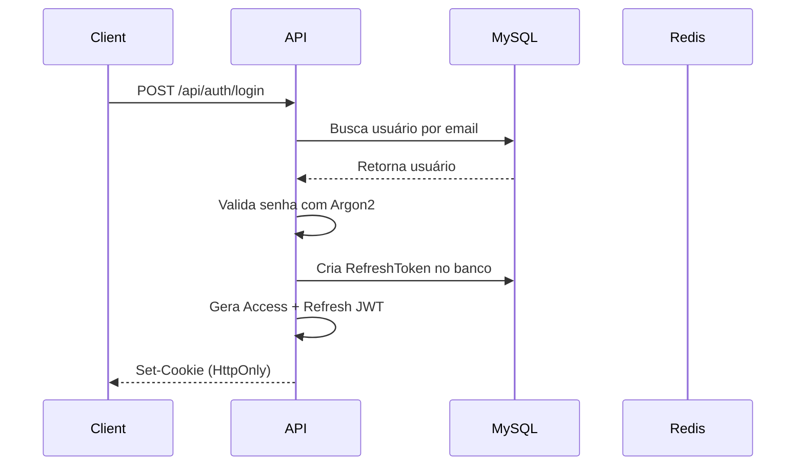
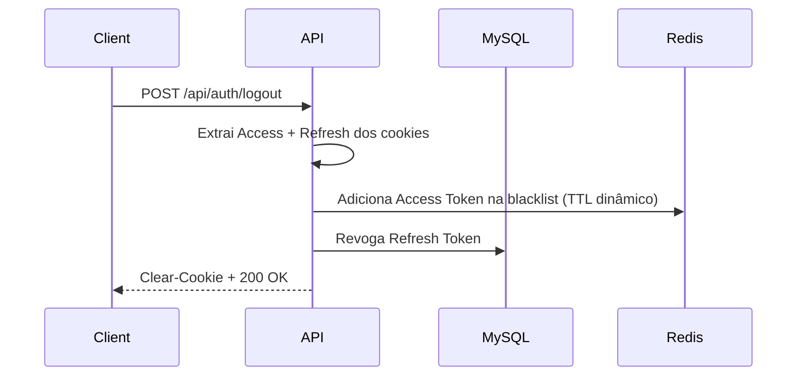

# 🔐 Secure Distributed Auth Gateway

[](README.md)
[](README.pt-br.md)


Sistema profissional de autenticação JWT baseado em **HttpOnly Cookies**, **Redis Blacklist** e proteção **CSRF**, seguindo padrões OWASP e Clean Architecture.

---

## 🎯 Objetivo

Este é um **Proof of Concept (PoC)** que demonstra:

- ✅ Autenticação **stateless** (JWT) com revogação **stateful** (Redis Blacklist)
- ✅ **Automatic Token Rotation** com **Grace Period** (evita race conditions)
- ✅ **Reuse Detection** (detecta roubo de tokens e revoga toda a cadeia)
- ✅ **Rate Limiting Híbrido** (por IP + Email para login, bloqueio de brute-force)
- ✅ **CSRF Protection** (Synchronizer Token Pattern)
- ✅ **HttpOnly Cookies** (mitigação de XSS)
- ✅ **Clean Architecture** modular (Controllers → Services → Repositories)

---

## 🛠️ Stack Tecnológico

| Categoria | Tecnologia |
|-----------|------------|
| **Runtime** | Node.js 20 + TypeScript (Strict Mode) |
| **Framework** | Express.js |
| **Database** | MySQL 8.0 (via Prisma ORM) |
| **Cache & Blacklist** | Redis 7 |
| **Hashing** | Argon2id (Password Hashing Competition winner) |
| **Tokens** | JSON Web Tokens (JWT) |
| **Validation** | Zod |
| **Security** | Helmet, CORS, HPP, Rate Limiter Flexible |
| **DevOps** | Docker + Docker Compose, GitHub Actions |

---

## 📂 Arquitetura de Pastas

```
secure-auth-poc/
├── src/
│   ├── @types/             # Type definitions globais
│   ├── config/             # Validação de env (Zod)
│   ├── modules/            # Módulos de negócio
│   │   ├── auth/           # Autenticação (Login, Refresh, Logout)
│   │   └── user/           # Usuário (Profile, Update Password)
│   ├── shared/             # Código reutilizável
│   │   ├── errors/         # AppError customizado
│   │   ├── middlewares/    # AuthGuard, RateLimiter, CSRF
│   │   ├── utils/          # HashProvider, TokenManager, Blacklist
│   │   └── infra/          # Redis Client
│   ├── app.ts              # Setup do Express
│   └── server.ts           # Entry point
├── prisma/
│   └── schema.prisma       # Modelagem do banco
├── docker-compose.yml      # MySQL + Redis
└── README.md
```

---

## 🚀 Como Rodar

### 1. Clone o repositório

```bash
git clone https://github.com/GersonResplandes/secure-auth-poc.git
cd secure-auth-poc
```

### 2. Configure as variáveis de ambiente

```bash
cp .env.example .env
# Edite o .env e altere os secrets de JWT e CSRF
```

### 3. Suba o ambiente com Docker

```bash
npm run docker:up
```

Isso iniciará:
- **MySQL** (porta 3306)
- **Redis** (porta 6379)

### 4. Instale as dependências

```bash
npm install
```

### 5. Execute as migrations do Prisma

```bash
npx prisma migrate dev
```

### 6. Inicie o servidor

```bash
npm run dev
```

O servidor estará rodando em **http://localhost:3000**

---

## 🧪 Rodando Testes

Este projeto possui testes **unitários** e de **integração** com gerenciamento automático de infraestrutura.

### Executar Todos os Testes (Recomendado)

```bash
npm test
```

**O que acontece:**
1. ✅ Sobe containers Docker (MySQL + Redis) automaticamente
2. ✅ Executa testes unitários (HashProvider, TokenManager)
3. ✅ Executa testes de integração (Auth flow completo)
4. ✅ Mantém containers rodando para reuso

**Resultado esperado:** `46 tests passed`

### Apenas Testes Unitários (Rápido - sem Docker)

```bash
npm run test:unit
```

Executa apenas testes que não dependem de infraestrutura (~2s).

### Apenas Testes de Integração

```bash
npm run test:integration
```

Testa fluxos end-to-end (Registro → Login → Refresh → Logout).

### Coverage Report

```bash
npm run test:coverage
```

Gera relatório de cobertura em `coverage/lcov-report/index.html`.

**Threshold:** 70% (branches, functions, lines, statements)

### Parar Infraestrutura de Testes

```bash
npm run docker:down
```

---

## 📖 Endpoints da API

### **Autenticação**

#### POST `/api/auth/register`

Registra um novo usuário.

**Body:**
```json
{
  "email": "user@example.com",
  "password": "Senha123",
  "name": "John Doe"
}
```

**Response (201):**
```json
{
  "status": "success",
  "message": "User registered successfully",
  "data": {
    "user": {
      "id": "uuid",
      "email": "user@example.com",
      "name": "John Doe",
      "createdAt": "2024-01-01T00:00:00.000Z"
    }
  }
}
```

---

#### POST `/api/auth/login`

Faz login e retorna cookies HttpOnly.

**Body:**
```json
{
  "email": "user@example.com",
  "password": "Senha123",
  "rememberMe": false
}
```

**Response (200):**
```json
{
  "status": "success",
  "message": "Login successful",
  "data": {
    "user": {
      "id": "uuid",
      "email": "user@example.com",
      "name": "John Doe"
    }
  }
}
```

**Cookies enviados:**
- `access_token` (15 min, HttpOnly, Secure, SameSite=Strict)
- `refresh_token` (7 dias ou 30 dias se `rememberMe=true`)

---

#### POST `/api/auth/refresh`

Renova o Access Token usando Automatic Rotation.

**Response (200):**
```json
{
  "status": "success",
  "message": "Tokens refreshed successfully"
}
```

---

#### POST `/api/auth/logout`

Revoga os tokens e limpa os cookies.

**Response (200):**
```json
{
  "status": "success",
  "message": "Logout successful"
}
```

---

### **Usuário (Protegidas)**

#### GET `/api/users/me`

Retorna dados do usuário autenticado.

**Response (200):**
```json
{
  "status": "success",
  "data": {
    "user": {
      "userId": "uuid",
      "email": "user@example.com"
    }
  }
}
```

---

#### PATCH `/api/users/password`

Atualiza a senha do usuário.

**Body:**
```json
{
  "currentPassword": "Senha123",
  "newPassword": "NovaSenha456"
}
```

**Response (200):**
```json
{
  "status": "success",
  "message": "Password updated successfully. Please login again."
}
```

> **Nota:** Todos os tokens ativos são revogados após a atualização de senha.

---

## 🔒 Decisões de Arquitetura (ADRs)

### 1. Por que HttpOnly Cookies?

**Problema:** Tokens armazenados em `localStorage` são vulneráveis a ataques XSS.

**Solução:** Cookies com flag `HttpOnly` não são acessíveis via JavaScript, protegendo contra scripts maliciosos.

---

### 2. Por que Redis Blacklist?

**Problema:** JWT é stateless, então não há como revogar um token antes da expiração.

**Solução:** Ao fazer logout ou trocar senha, o token é adicionado a uma blacklist no Redis com **TTL dinâmico** (calculado a partir da expiração do token).

---

### 3. Por que Automatic Rotation + Grace Period?

**Problema:** Em aplicações modernas, o frontend faz requisições paralelas (ex: carregar perfil + notificações ao mesmo tempo). Ambas podem expirar o Access Token e tentar fazer refresh simultaneamente, causando race conditions.

**Solução:** Quando um Refresh Token é usado, geramos um novo par de tokens e salvamos o novo Refresh Token em um campo `gracePeriodToken` do token antigo por 5-10 segundos. Se o token antigo for usado novamente dentro desse período, retornamos o mesmo token novo já gerado.

---

### 4. Por que Stateless JWT + Stateful Logout?

**Trade-off:** JWT puro é stateless (ótimo para escalar horizontalmente), mas não permite revogação imediata. Adicionando Redis apenas no logout/troca de senha, mantemos os benefícios de performance do JWT e ganhamos segurança quando necessário.

---

### 5. Estratégia de Cookies (HttpOnly Strategy)

Nossa implementação utiliza **cookies HttpOnly** para armazenar tokens de forma segura, protegendo contra XSS e CSRF.

#### **Configuração dos Cookies**

| Cookie | Max Age | HttpOnly | Secure | SameSite | Path | Descrição |
|--------|---------|----------|--------|----------|------|-----------|
| `access_token` | 15 min | ✅ | ✅ | Strict | `/` | Token de acesso para requisições autenticadas |
| `refresh_token` | 7 dias (ou 30 dias*) | ✅ | ✅ | Strict | `/api/auth/refresh` | Token para renovação sem re-login |
| `csrf_token` | Session | ❌ | ✅ | Strict | `/` | Token CSRF para validação (acessível via JS) |

**(\*) 30 dias quando `rememberMe: true`**

#### **Flags de Segurança Explicadas**

- **HttpOnly**: Impede que JavaScript acesse o cookie, mitigando XSS.
- **Secure**: Cookie só é enviado via HTTPS (⚠️ disable em dev se não tiver SSL).
- **SameSite=Strict**: Previne envio do cookie em requisições cross-site (proteção CSRF).
- **Path**: Restringe onde o cookie é enviado (refresh_token só vai para `/api/auth/refresh`).

#### **Fluxo de "Lembrar de Mim"**

```typescript
// Login com rememberMe: false → Refresh Token expira em 7 dias
POST /api/auth/login
{
  "email": "user@example.com",
  "password": "senha123",
  "rememberMe": false
}

// Login com rememberMe: true → Refresh Token expira em 30 dias
POST /api/auth/login
{
  "email": "user@example.com",
  "password": "senha123",
  "rememberMe": true
}
```

#### **Por que Path Restrito no Refresh Token?**

**Problema**: Se o refresh token fosse enviado em **todas** as requisições, aumentaríamos a superfície de ataque (mais oportunidades de interceptação).

**Solução**: Configuramos `Path: /api/auth/refresh`, então o navegador **só envia** o refresh token para esse endpoint específico. Access tokens continuam sendo enviados para todas as rotas autenticadas.

---

## 📊 Fluxos Principais

### **Login Flow**



---

### **Refresh Flow (com Automatic Rotation)**

```mermaid
sequenceDiagram
    participant Client
    participant API
    participant MySQL
    participant Redis

    Client->>API: POST /api/auth/refresh (com cookie)
    API->>API: Verifica JWT do Refresh Token
    API->>MySQL: Busca token no banco
    alt Token já foi usado (reuse detected)
        MySQL-->>API: Token revogado
        API->>MySQL: Revoga TODOS tokens do usuário
        API->>Redis: Blacklist TODOS tokens (1h)
        API-->>Client: 401 Unauthorized
    else Token válido
        API->>API: Gera novos tokens
        API->>MySQL: Cria novo RefreshToken
        API->>MySQL: Ativa Grace Period no token antigo
        API-->>Client: Set-Cookie (novos tokens)
    end
end
```

---

### **Logout Flow**



---

## 🧪 Testando com cURL

### Registro

```bash
curl -X POST http://localhost:3000/api/auth/register \
  -H "Content-Type: application/json" \
  -d '{"email":"test@example.com","password":"Test1234","name":"Test User"}'
```

### Login

```bash
curl -X POST http://localhost:3000/api/auth/login \
  -H "Content-Type: application/json" \
  -d '{"email":"test@example.com","password":"Test1234","rememberMe":false}' \
  -c cookies.txt
```

### Acessar rota protegida

```bash
curl -X GET http://localhost:3000/api/users/me \
  -b cookies.txt
```

### Logout

```bash
curl -X POST http://localhost:3000/api/auth/logout \
  -b cookies.txt
```

---

## 🔐 Segurança Implementada

| Ameaça | Mitigação |
|--------|-----------|
| **XSS** | Cookies HttpOnly |
| **CSRF** | Synchronizer Token Pattern |
| **Brute-force** | Rate Limiting Híbrido (IP + Email) |
| **Token Theft** | Reuse Detection + Blacklist |
| **Weak Passwords** | Validação Zod + Argon2 |
| **Timing Attacks** | Constant-time comparison no CSRF |
| **SQL Injection** | Prisma ORM (prepared statements) |

---

## 📝 Licença

MIT License - Este projeto é de código aberto e pode ser usado livremente.

---

## 👤 Autor

**Gerson Resplandes**  
[LinkedIn](https://www.linkedin.com/in/gerson-resplandes) | [GitHub](https://github.com/GersonResplandes)

---

**⭐ Se este projeto foi útil, deixe uma estrela no GitHub!**
